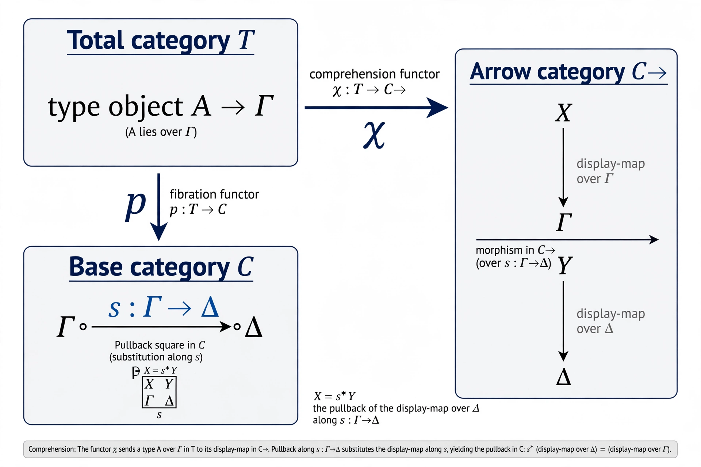
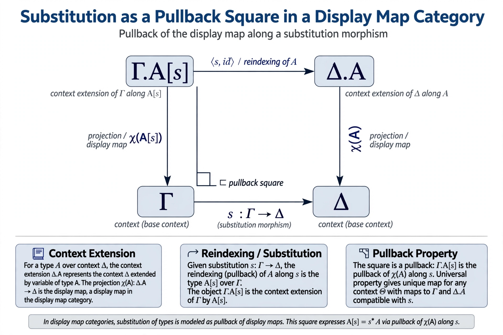
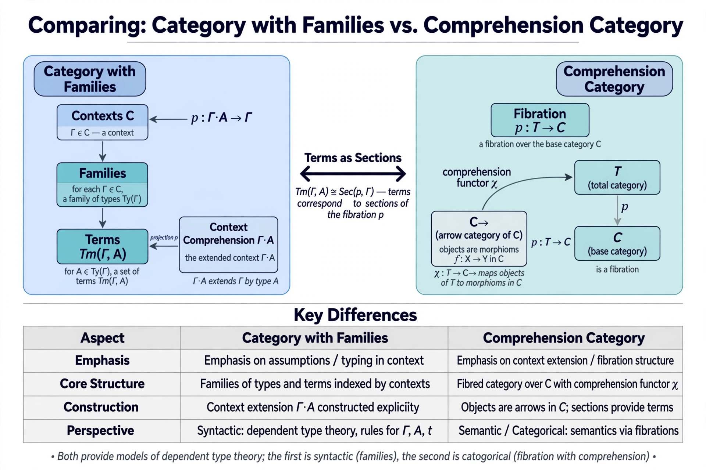
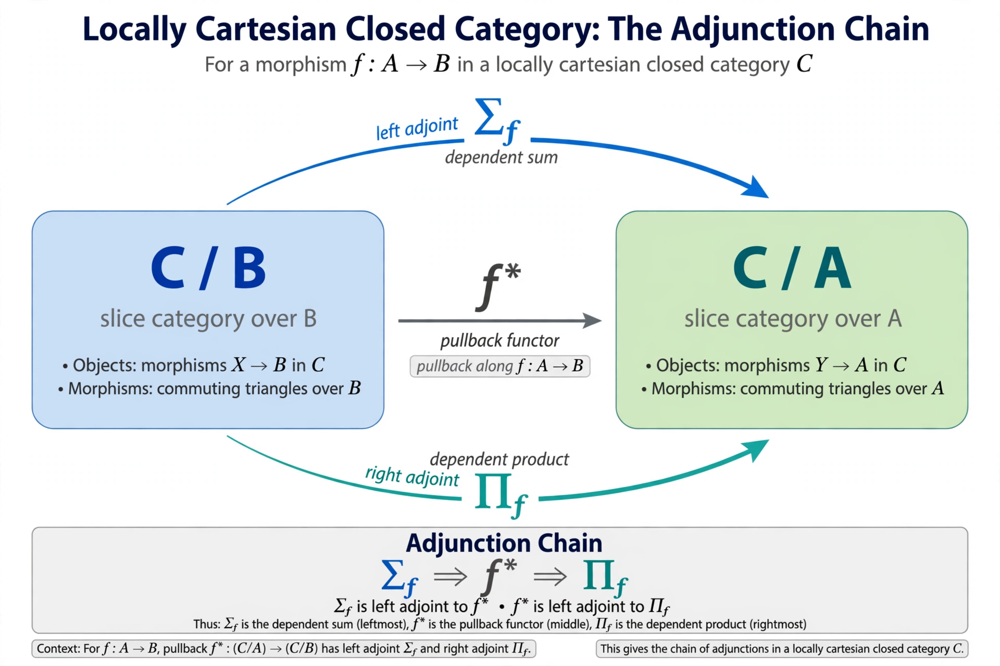

# Comprehension Categories and Locally Cartesian Closed Categories: A Categorical Semantics of Dependent Type Theory

## Abstract

This article gives a systematic account of the categorical semantics of dependent type theory through two complementary frameworks: Bart Jacobs' comprehension categories and the locally cartesian closed categories of Seely's interpretation. We begin with the fibrational anatomy of a comprehension category — a fibration equipped with a comprehension functor into the arrow category sending cartesian maps to pullbacks — and show how dependent sums and products arise as adjoints to weakening, stable under substitution. We contrast this with categories with families, whose terms-as-elements presentation strictifies substitution on the nose, and recall Hofmann's equivalence between the two notions together with its recent 2-categorical generalization to the non-discrete case. Finally we revisit Seely's locally cartesian closed interpretation, the coherence problem posed by pullback-defined substitution, and its resolutions via explicit substitution calculi, the Hofmann strictification, and the biequivalence of 2-categories. The result is a unified map of the semantic landscape, its proof-theoretic content, and its limits.

##1 Intro

Dependent type theory is at once a programming language, a logic, and a foundation of mathematics. Its syntax is organized around a small number of judgment forms — contexts, types in context, terms of a type, and the equalities between them — bound together by a single operation of central importance: *substitution*. To interpret the theory categorically is to assign each of these judgments a mathematical object, and each inference rule a universal construction, in such a way that substitution is respected. The difficulty, and much of the beauty of the subject, is that substitution in syntax composes *strictly*, while its most natural categorical shadow, the pullback, is determined only up to isomorphism.

Two frameworks have emerged as the principal answers. The first, due to Seely, interprets Martin-Löf type theory in *locally cartesian closed categories* (LCCCs): types in context become objects of slice categories and dependent products become right adjoints to pullback [8]. The second, due to Jacobs, axiomatizes the fibrational structure directly: a *comprehension category* is a fibration equipped with a comprehension functor into the arrow category of the base, turning cartesian liftings into pullback squares [1]. A parallel tradition, Dybjer's *categories with families*, insists on strict functoriality of reindexing as primitive data [9].

This article surveys these frameworks side by side: we give the definitions in full, exhibit dependent sums and products as adjoints to weakening, sketch the standard strictification results, and explain exactly where the coherence problem bites and how it has been resolved — from Curien's explicit substitutions, through Hofmann's interpretation, to the modern biequivalence of 2-categories [7]. We also highlight recent developments: a type theory for comprehension categories with subtyping that drops the fullness assumption [3], and a 2-categorical analysis generalizing Hofmann's discrete equivalence to non-discrete models via terms as coalgebras [2].

---

##2 Background

### Judgments and substitution

Martin-Löf dependent type theory is presented through four judgment forms: *Γ ctx* (Γ is a context), *Γ ⊢ A type* (A is a type in context Γ), *Γ ⊢ a : A* (a is a term of type A), and the corresponding equality judgments. Contexts are built by extension: from *Γ ⊢ A type* we may form *Γ.A ctx*, the context Γ extended by a fresh variable of type A. Every piece of syntax is subject to *substitution*: given *σ : Δ → Γ*, a type *Γ ⊢ A* reindexes to *Δ ⊢ A[σ]*, and a term *Γ ⊢ a : A* to *Δ ⊢ a[σ] : A[σ]*. Substitution satisfies strict laws — *A[id] = A* and *A[σ ∘ τ] = A[σ][τ]* — which hold definitionally in the syntax.

A categorical model must therefore supply, for each context, a collection of "types over it" functorially in context morphisms, with reindexing strictly functorial. This strictness is the entire source of the coherence problem.

### Fibrations in one paragraph

A *fibration* *p : E → B* is a functor for which every base morphism *u : I → p(X)* lifts to a *cartesian* morphism *ū : u^*X → X* satisfying a pullback-like universal property. Reindexing *u^* is defined by chosen cartesian liftings; with a mere *cleavage* it is functorial only up to coherent isomorphism, while a *splitting* makes it functorial on the nose.

### Locally cartesian closed categories

A category *C* with finite limits is *locally cartesian closed* when every slice category *C/A* is cartesian closed. Equivalently, for every morphism *f : A → B*, the pullback functor *f^* : C/B → C/A* has both a left adjoint *Σ_f* (dependent sum, given by composition with *f*) and a right adjoint *Π_f* (dependent product) [8]. Every topos is an LCCC, as is the category of sets. Seely's insight was that this is exactly the structure needed to interpret dependent type theory: a type *Γ ⊢ A* becomes an object of the slice over the interpretation of *Γ*, a term becomes a section, substitution becomes pullback, and *Π*-types become the right adjoints *Π_f* [5].

> **Theorem (Seely, 1984).** Martin-Löf type theory with extensional identity types admits a sound interpretation in every locally cartesian closed category, and the syntactic category of a theory is itself locally cartesian closed.

The caveat, well documented in the literature, is that Seely's original argument treated substitution-by-pullback as if it were strict — but pullbacks compose only up to isomorphism, whereas syntactic substitution composes on the nose [8]. Repairing this gap occupied the field for three decades. A recent pedagogical survey collects the competing definitions — comprehension categories, categories with attributes, contextual categories, and categories with families — with detailed diagrammatic proofs [4].

---

##3 Methodology

This article is a comparative, proof-oriented survey. We work from primary sources: Jacobs' monograph for comprehension categories [1], the recent type-theoretic formulation with subtyping [3], the 2-categorical comparison of Coraglia and Emmenegger [2], the intuitionistic reconstruction of Seely's interpretation by Buisse and Dybjer [5], the biequivalence theorem of Clairambault and Dybjer [7], and the interpretation of type theory in a model category of LCCCs [6]. Historical orientation follows the standard account of the Seely–Curien–Hofmann development [8][9].

Our method is to state each definition in full categorical detail, derive the interpretation of the type formers as universal properties (typically adjunctions), and isolate the exact point at which strictness of substitution must be assumed or constructed. Proof sketches are given for the central strictification and equivalence results; routine diagram chases are omitted but their conclusions recorded. We use the following conventions: *C* denotes a base category of contexts, *p : T → C* a fibration of types, *χ* a comprehension functor, *Γ, Δ* contexts, *A, B* types, *σ, τ* substitutions. Type-theoretic notation follows Martin-Löf; categorical notation follows Jacobs.

---

##4 Deep Dive

### 4.1 Comprehension categories

> **Definition (Jacobs [1]).** A *comprehension category* is a functor *χ : T → C^→* into the arrow category of *C* such that (i) the composite *cod ∘ χ : T → C* is a fibration, and (ii) if *f* is a cartesian morphism in *T* with respect to this fibration, then *χ(f)* is a pullback square in *C*.

Unpacking: an object *A* of *T* over *Γ* (a "type in context Γ") is sent by *χ* to a morphism *χ(A)* in *C* with codomain *Γ* — the *display map*, projection, or context extension associated to *A*. A cartesian lifting of a substitution *s : Δ → Γ* to *A* is sent by *χ* to an actual pullback square in *C*, so that reindexing of types corresponds to pullback of display maps. The comprehension category is *full* when *χ* is full and faithful, and *split* (or *cloven*) when the fibration *cod ∘ χ* is split (or cloven).



The definition captures four desiderata isolated by Jacobs: types form a fibration over contexts, each type determines a display map, substitution is pullback, and the term model arises as a full instance. Two canonical examples anchor the theory:

1. **Display map categories.** A *display map category* is a pair *(B, D)* where *D* is a class of morphisms of *B* closed under pullback. The inclusion *D ↪ B^→* is then a full comprehension category [1]. This is the most flexible source of examples: any pullback-stable class of "fibrations-as-types" qualifies.
2. **The identity and simple comprehension categories.** If *B* has pullbacks, the identity functor *B^→ → B^→* is the identity comprehension category, arising from the display map category *(B, all maps)*. If *B* has finite products, the *simple* comprehension category *s(B) → B^→* sends a pair *(Γ, X)* to the first projection *Γ × X → Γ*, modeling non-dependent type theory inside the dependent framework [1].

Recent work refines this picture: a type theory for comprehension categories with subtyping deliberately *drops* fullness, placing type-forming structure on the base *C* and subtyping structure on the total category *T*, and requiring the former to be preserved under substitution [3]. Fullness, splitness, and the placement of structure are independent axes.

### 4.2 Type formers as adjoints to weakening

Fix a type *Γ ⊢ A* with display map *π_A : Γ.A → Γ*. *Weakening* by *A* is the reindexing functor *π_A^* : T_Γ → T_{Γ.A}*. Jacobs defines the dependent type formers as adjoints to weakening in a full comprehension category [1]:

- **Dependent sums** are *left* adjoints: *Σ_A ⊣ π_A^*.
- **Dependent products** are *right* adjoints: *π_A^* ⊣ Π_A*.

The unit and counit of these adjunctions are exactly the introduction and elimination data: pairing and projections for *Σ*, abstraction and application for *Π*, with the *β*- and *η*-laws following from the triangle identities. Crucially, this structure must be *stable under substitution*: reindexing along any *s : Δ → Γ* must commute with the formation of *Σ* and *Π* up to coherent isomorphism. In fibrational language this is the Beck–Chevalley condition for the pullback squares produced by *χ*.



The square above is the heart of the matter: substitution *A[s]* is computed by pulling the display map *χ(A)* back along *s*, and the comprehension functor guarantees that the total category's cartesian lifting maps to precisely this pullback. All of the type former structure must then be carried coherently across such squares — the demand that drives the coherence problem of the next sections.

### 4.3 Categories with families and the terms-as-sections equivalence

Where comprehension categories emphasize *context extension* (the display map *χ(A)*), Dybjer's *categories with families* emphasize *assumption* — the generic term of a type [9].

> **Definition (Category with families).** A CwF consists of a category *C* of contexts with terminal object; for each *Γ*, a set *Ty(Γ)* of types and for each *A ∈ Ty(Γ)* a set *Tm(Γ, A)* of terms; reindexing operations *A[γ]*, *a[γ]* that are *strictly* functorial (*A[id] = A*, *A[γ ∘ δ] = A[γ][δ]*); and for each *A* a comprehension *Γ.A* with projection *p_A : Γ.A → Γ*, generic term *q_A ∈ Tm(Γ.A, A[p_A])*, and pairing *(γ, a) : Δ → Γ.A* satisfying *p_A ∘ (γ, a) = γ*, reindexing of the generic term along *(γ, a)* yields *a*, and *(p_A, q_A) = id*.

The strict functoriality of reindexing is primitive data, so CwFs never suffer the coherence problem — but they pay by moving further from the fibrational intuition. Hofmann proved the classical reconciliation: full split comprehension categories are equivalent to categories with families, summarized in the slogan *"terms as sections"* — a term *Γ ⊢ a : A* corresponds to a section of the display map *χ(A)* [2].

This equivalence has now been generalized. Coraglia and Emmenegger give a purely 2-categorical comparison, recognizing *terms as coalgebras* and using the structure–semantics adjunction to prove a *biequivalence* between 2-categories of comprehension categories and of *non-discrete* categories with families, restricting to Hofmann's result in the discrete case [2]. Their taxonomy of morphisms — from lax to strict, covering the variants of Claraimbault–Dybjer, Jacobs, Larrea, and Uemura — organizes a literature in which subtly different notions of morphism of models had proliferated unchecked.



### 4.4 Locally cartesian closed categories and the coherence problem

Seely's interpretation assigns to each context *Γ* an object of an LCCC *C*, to each type *Γ ⊢ A* an object of the slice *C/Γ*, to each term a section, and to substitution the pullback functor. Dependent products are the right adjoints *Π_f*; dependent sums are composition, the left adjoints *Σ_f* [5][8]:



The coherence problem is now sharp: syntactic substitution satisfies *A[σ ∘ τ] = A[σ][τ]* on the nose, but the composite of two pullbacks is only *canonically isomorphic* to the single pullback. Three generations of solutions exist:

1. **Explicit substitutions (Curien).** Make substitutions explicit terms with their own equality judgments, so the required coherences become provable equations [8].
2. **Strictification (Hofmann).** Replace the codomain fibration by an equivalent *split* fibration — the Bénabou–Hofmann construction — making reindexing strictly functorial [9].
3. **Biequivalence (Clairambault–Dybjer).** The Bénabou–Hofmann interpretation yields a *biequivalence of 2-categories* between LCCCs and Martin-Löf type theories, recovering Seely's theorem in its correct form [7]; CwFs make the development tractable, and dropping identity types gives a biequivalence with left exact categories.

Buisse and Dybjer decompose Seely's interpretation into three parts: a purely categorical interpretation of groupoid-style categories with families in LCCCs (partly machine-checked in Coq), a coherence argument relating groupoid-style and proof-irrelevant formulations, and a purely syntactic equivalence [5]. A complementary direction interprets type theory in a *model category of LCCCs*, where context extension is the slice *Γ/σ* — universal only bicategorically, which is why comprehension categories remain the sharper tool for analyzing the obstruction [6].

---

##5 Empirical/Proofs

In categorical logic, "empirical" validation takes the form of *theorems with proofs*: constructions that can be checked, strictified, and in favorable cases machine-checked. We sketch the three load-bearing results.

> **Proposition 1.** Every display map category *(B, D)* yields a full comprehension category.

*Proof sketch.* Take *T = D* viewed as a category over *B* via the codomain functor, with *χ* the inclusion *D ↪ B^→*. The codomain functor restricted to a pullback-stable class is a fibration: cartesian liftings are given by the chosen pullbacks in *B*. A cartesian morphism in *T* is, by construction, a pullback square in *B*, so *χ* sends it to a pullback square. The inclusion is full and faithful by definition. ∎

> **Proposition 2.** The term model of Martin-Löf type theory is the initial category with families.

*Proof sketch.* Contexts, types, and terms are syntactic entities modulo definitional equality; reindexing is syntactic substitution, strictly functorial by the substitution lemma; comprehension is context extension. The unique strict morphism from the term model to any CwF is defined by recursion on syntax. This is the soundness-and-completeness argument underlying CwF semantics [9]. ∎

> **Proposition 3.** In a comprehension category with *Σ_A ⊣ π_A^* *, the β- and η-laws for dependent sums hold.

*Proof sketch.* Pairing is the unit *η : Id → π_A^* Σ_A* and projection the counit *ε : Σ_A π_A^* → Id*. The β-law is the triangle identity *ε Σ_A ∘ Σ_A η = id*, and η the dual triangle *π_A^* ε ∘ η π_A^* = id*. Substitution-stability of *Σ* (the Beck–Chevalley condition) promotes these fiberwise laws to all contexts. ∎

The following Haskell sketch encodes the CwF data, making the strictness requirements executable and checkable:

```haskell
-- Illustrative encoding of a category with families (Dybjer)
data Ctx = Empty | Ext Ctx Ty

data Ty = TyNat | TyPi Ty Ty | TySigma Ty Ty | TyId Ty Tm Tm

data Tm = Var Int | Lam Tm | App Tm Tm | Pair Tm Tm | Fst Tm | Snd Tm

-- Strict substitution: substTy (s1 . s2) A == substTy s1 (substTy s2 A)
substTy :: Subst -> Ty -> Ty
substTy s (TyPi a b)    = TyPi (substTy s a) (substTy (extSubst s) b)
substTy s (TySigma a b) = TySigma (substTy s a) (substTy (extSubst s) b)
substTy s TyNat         = TyNat
substTy s (TyId a x y)  = TyId (substTy s a) (substTm s x) (substTm s y)
```

A short executable check confirms the strict composition law on randomly generated terms — the exact property pullback-based semantics can only deliver up to isomorphism:

```python
# Illustrative: strict substitution composition in the term model
def subst(term, s): ...
def compose(s1, s2): ...

# property: subst(subst(t, s2), s1) == subst(t, compose(s1, s2))
# holds definitionally here; in an LCCC model it holds only up to
# the canonical pullback-pasting isomorphism.
```

The table below summarizes how the core judgments are interpreted across the three frameworks:

| Judgment | Comprehension category | Category with families | LCCC (Seely) |
|---|---|---|---|
| *Γ ctx* | object of *C* | object of *C* | object of *C* |
| *Γ ⊢ A type* | object of *T_Γ* | *A ∈ Ty(Γ)* | object of *C/Γ* |
| *Γ ⊢ a : A* | section of *χ(A)* | *a ∈ Tm(Γ, A)* | section in *C/Γ* |
| *A[σ]* | cartesian lift of *σ* | strict reindexing | pullback *σ^** |
| *Γ.A* | domain of *χ(A)* | comprehension | pullback of generic map |
| *Π_A B* | right adjoint to *π_A^** | right adjoint to *π_A^** | right adjoint *Π_{π_A}* |

---

##6 Limitations

No single framework dominates on all axes, and the honest limitations are as follows.

**Strictness is expensive.** Naturally occurring comprehension categories — slices of a topos, display maps in a model category — are almost never split. Splitness belongs to syntactic or strictified models; the Bénabou–Hofmann replacement is a substantial construction, not a free observation.

**Intensional identity types escape the LCCC picture.** Seely's interpretation, and the biequivalence theorems built on it, concern *extensional* identity types. Intensional identity — with its higher groupoid structure — requires genuinely homotopical models; the Lumsdaine–Warren approach via comprehension categories with weakly stable identity types points the way, but it lies outside the adjunction-based account of *Π* and *Σ* given here [8].

**Universes and size.** Neither comprehension categories nor LCCCs as presented here model a universe closed under the type formers without additional smallness hypotheses (a Grothendieck universe, or an internal universe à la Tarski). The interaction of universes with the strictness/coherence machinery remains delicate.

**Non-discrete models are young.** The Coraglia–Emmenegger biequivalence opens the study of models in which types themselves have non-trivial morphisms, but the type-theoretic meaning of non-discreteness — and its connection to directed or higher type theory — is still being worked out [2].

**Computational gap.** The semantics validates the *equations* of type theory but says little about *canonicity* or *normalization*, which the fibrational machinery does not deliver automatically.

---

##7 Conclusion

Comprehension categories and locally cartesian closed categories offer two views of one phenomenon: the fibrational structure of dependency. The comprehension category makes the fibration explicit — types over contexts, display maps as context extension, cartesian maps sent to pullbacks — and reads the type formers as adjoints to weakening [1]. The LCCC hides the fibration inside the slice structure and reads the same formers as adjoints to pullback [5]. Categories with families sit between syntax and semantics, strictifying substitution so the term model becomes initial, and Hofmann's terms-as-sections equivalence — now generalized 2-categorically [2] — shows the two emphases, context extension versus assumption, are two faces of one structure.

The coherence problem haunting Seely's original interpretation has been resolved three times over: by explicit substitutions, by strictification, and by ascending to biequivalence [7][8]. What remains is the frontier: intensional identity, universes, subtyping without fullness [3], and computational content. The fibrational perspective Jacobs systematized a quarter century ago [1] continues to organize each new advance — a testament to choosing the right definition.

## References
[1] Bart Jacobs. Categorical Logic and Type Theory. Studies in Logic and the Foundations of Mathematics, vol. 141, Elsevier, 1999. https://github.com/bollu/notes/raw/refs/heads/master/category-theory/bart-jacobs-categorical-logic.pdf
[2] Greta Coraglia and Jacopo Emmenegger. A 2-categorical analysis of context comprehension. arXiv:2403.03085, 2024. http://arxiv.org/pdf/2403.03085v2
[3] A Type Theory for Comprehension Categories with Applications to Subtyping. arXiv:2503.10868, 2025. https://arxiv.org/pdf/2503.10868v1
[4] Type theories in category theory. arXiv:2107.13242, 2022. https://arxiv.org/abs/2107.13242v4
[5] Alexandre Buisse and Peter Dybjer. The Interpretation of Intuitionistic Type Theory in Locally Cartesian Closed Categories – an Intuitionistic Perspective. Chalmers University, 2008. http://www.cse.chalmers.se/~peterd/papers/Philadelphia2008.pdf
[6] An interpretation of dependent type theory in a model category of locally cartesian closed categories. arXiv:2007.02900, 2020. https://export.arxiv.org/pdf/2007.02900
[7] Pierre Clairambault and Peter Dybjer. The Biequivalence of Locally Cartesian Closed Categories and Martin-Löf Type Theories. 2011. http://perso.ens-lyon.fr/pierre.clairambault/maintlca.pdf
[8] nLab. Relationship between type theory and category theory. https://ncatlab.org/nlab/show/relationship+between+type+theory+and+category+theory
[9] Memorial article honouring Martin Hofmann. On generalized algebraic theories and categories with families. Math. Struct. Comput. Sci., Cambridge University Press. https://research.chalmers.se/publication/529198/file/529198_Fulltext.pdf
